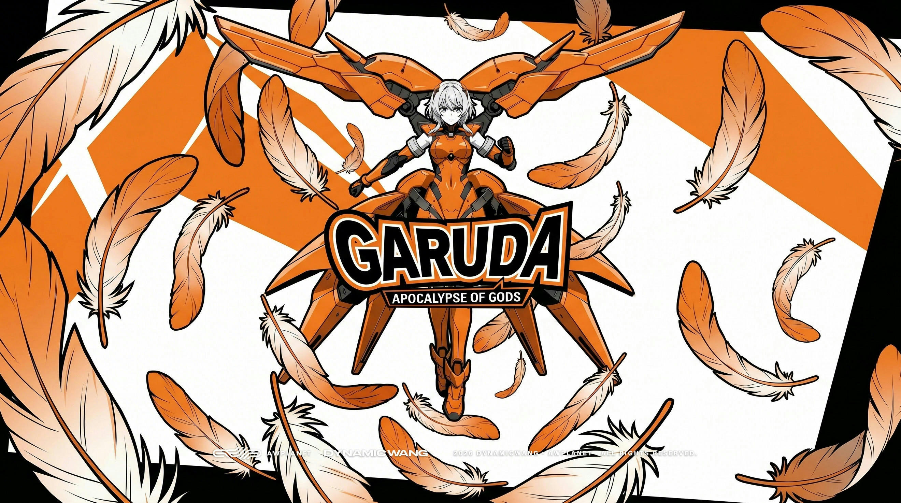
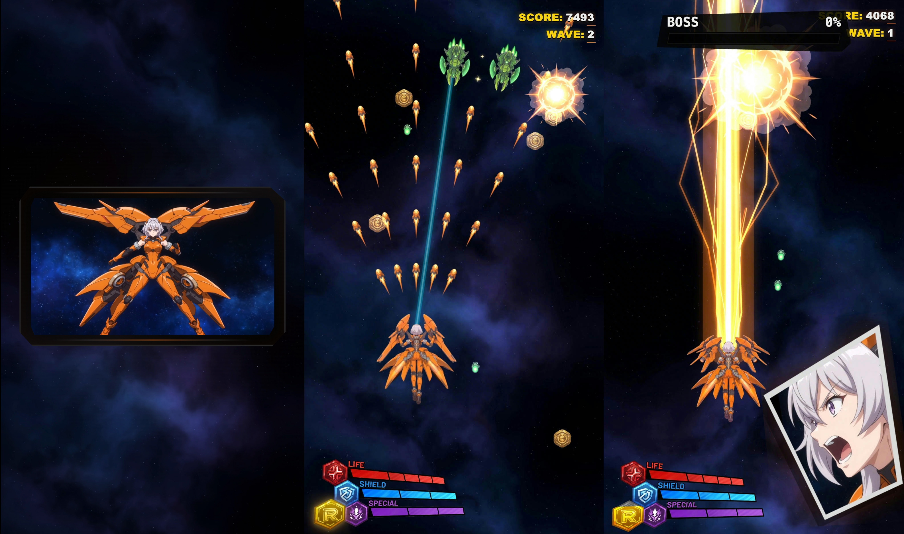
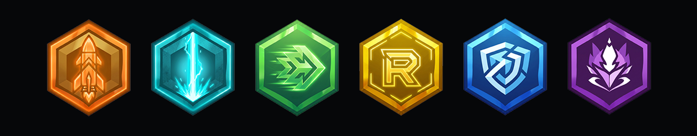

# Garuda: Apocalypse of Gods



[Play Garuda online](https://awplanets.github.io/garuda/)

**Garuda** is a STG + Roguelike vertical space shooter built with AI throughout
the full production pipeline. The development layer was constructed through a
Vibecoding workflow: core code and gameplay logic were completed in
collaboration with OpenAI Codex, while the visual direction combines NanoBanana
and Seedance 2 for art element creation and frame animation design. Codex was
then used for batch processing of art assets, keeping the final style
controllable, iterative, and highly unified. LibTV was used as the preferred
AI art platform; its stable model resources and compute support made it
possible to carry this project through a consistent production workflow.

Compared with typical clean-screen arcade shooters, **Garuda** targets a higher
60 fps frame rate, smoother high-speed pressure, sharper dodge feedback, denser
tactical structure inside bullet-heavy combat, and a more fluid Roguelike
growth curve.



## Roguelike Builds



More than six random talent paths can create different shooting styles:

- **Bullet Storm Assault**: ultra-high fire rate and coverage-based firepower
  suppress enemies, forming a near-storm of bullets across the screen.
- **Laser Ricochet**: refraction and chaining allow the laser to keep jumping
  between enemy groups for continuous field clearing.
- **Endless Shield**: shield recovery, energy loops, and counter-damage help
  the player stay nearly unkillable inside dense bullet pressure.
- **Particle AOE**: special weapons provide sustained full-field area damage,
  creating chained destruction across large enemy clusters.

Escalating enemy difficulty and randomized enemy traits keep each run tense and
challenging from wave to wave.

## Controls

- Arrow keys, WASD, or IJKL to move.
- Space, X, C, Z, Y, or 0 to fire.
- Q to activate shield.
- E to release bomb.
- R to trigger Killer when charged.
- P or Esc to pause.
- F to toggle fullscreen.

## Global Leaderboard

The game can use a global leaderboard through Cloudflare Worker + D1 while
keeping the local browser leaderboard as an offline fallback.

- Frontend reads and submits scores through `window.GARUDA_LEADERBOARD_API`.
- If the API URL is empty or unavailable, Rank automatically falls back to
  local browser storage.
- The Worker stores only the global Top 10, limits player names to 12
  characters, keeps scores and waves as integers, and rate-limits repeated
  submissions from the same IP.

Deployment files are in [`cloudflare/`](cloudflare/). After deploying the
Worker, paste its URL into `index.html`:

```html
<script>
window.GARUDA_LEADERBOARD_API = 'https://garuda-leaderboard.your-name.workers.dev';
</script>
```

## Resolution Guide

Garuda includes multiple render-resolution presets. For the smoothest
experience, choose a resolution based on your GPU class and available graphics
memory. If the game feels choppy during dense waves, lower the render
resolution first before reducing browser zoom or disabling fullscreen.

Recommended presets:

- **Windows integrated graphics / older laptops**: use **540 x 960** or
  **720 x 1280**. This is best for Intel UHD/Iris Xe-class graphics, older
  Radeon iGPUs, or systems with shared memory.
- **Windows entry-level dedicated GPUs**: use **720 x 1280** or **810 x 1440**.
  This fits GPUs around GTX 1050 / GTX 1650 / MX-series / RTX 2050-class
  hardware, especially with 2-4 GB VRAM.
- **Windows mid-range GPUs**: use **1080 x 1920**. Recommended for RTX 2060,
  RTX 3050, RTX 3060, RTX 4050, RX 5600, RX 6600, or similar cards with 4-8 GB
  VRAM.
- **Windows high-end GPUs**: use **1440 x 2560** if available and stable.
  Recommended for RTX 3070 / RTX 4070-class or stronger GPUs with 8 GB+ VRAM.
- **MacBook Air / Mac mini with M1 or M2**: use **720 x 1280** or
  **810 x 1440** for cooler, steadier play.
- **MacBook Pro / Mac with M1 Pro, M2 Pro, M3, or better**: use
  **1080 x 1920**. Higher presets can work, but 1080 x 1920 is the best
  balance for long sessions.
- **Intel Mac or older MacBook models**: use **540 x 960** or **720 x 1280**,
  especially when running on battery or in a browser with many tabs open.

## Local Development

```bash
npm run dev
```

```bash
npm run build
```

```bash
npm run web:release
```

The static web release is written to `../garuda_web_release`. It keeps the same
visual result while excluding desktop-only build output and unused source
videos. Online builds register a Service Worker so repeat visits reuse cached
assets.

## License

Source code is licensed under the [MIT License](LICENSE).

All visual, audio, video, animation, character, logo, UI, branding, and Garuda
IP assets are proprietary and registered for copyright protection. They are not
covered by the MIT License and may not be reused without explicit written
permission. See [ASSET_LICENSE.md](ASSET_LICENSE.md).

## Acknowledgements

Special thanks to [LibTV](https://www.liblib.tv/) for compute support and
production help throughout the project.
